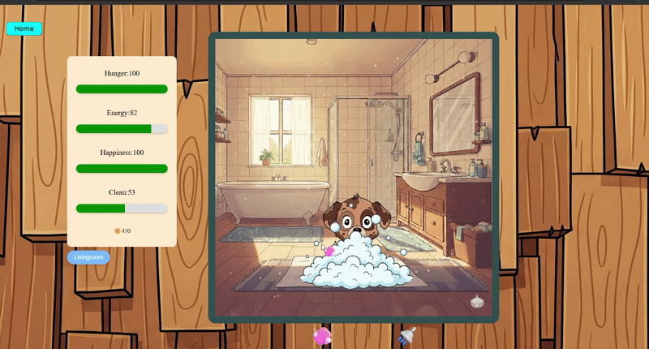
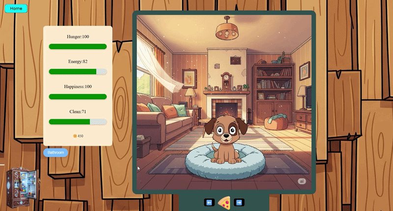
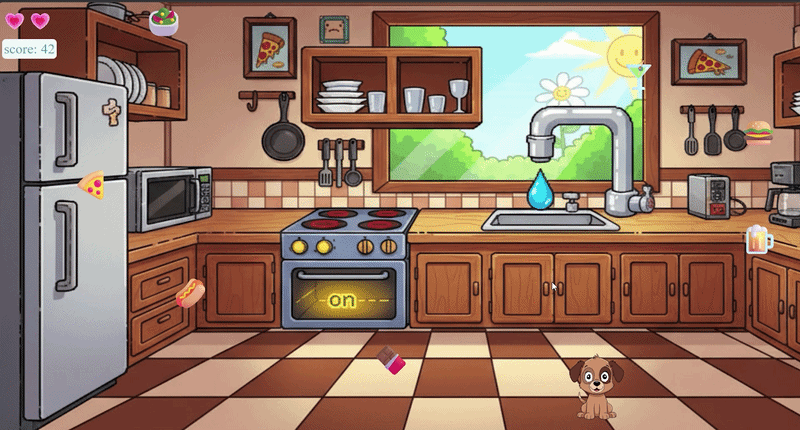

# 🐾 V-Pet

### Your tiny chaotic virtual companion living in the browser.

  Feed it • Wash it • Play with it • Keep it alive

  
  
  
  
  

  <a href="https://github.com/PeterKokenyessy/V-Pet">Repository</a>

---

# ✨ About

**V-Pet** is a browser-based virtual pet game built with **React**, **Vite**, and **Firebase**.

Take care of your pet by:
- 🍔 Feeding it
- 🥤 Giving it drinks
- 🛁 Bathing it
- 🎮 Playing mini-games
- 📈 Managing its stats

Different foods and drinks affect your pet in different ways, so keeping it happy and healthy becomes part strategy, part chaos.

The project also includes online score tracking where players can compare scores with others.

---

# 📸 Showcase

## Shower

  

---

##  Feeding System

  

---

##  Minigame

  

---

#  Features

| Feature | Description |
|---|---|
| 🍔 Feeding System | Different foods affect stats differently |
| 🥤 Drink System | Drinks provide unique boosts |
| 🛁 Bathing | Keep your pet clean and happy |
| 🎮 Minigames | Earn score by playing games |
| 🌍 Online Leaderboards | Compare scores with other players |
| ☁️ Firebase Backend | Realtime cloud-based data |
| ⚡ Vite Powered | Fast and lightweight frontend |
| 🎨 Responsive UI | Smooth modern interface |

---

# 🧠 Tech Stack

| Frontend | Backend | Deployment |
|---|---|---|
| React | Firebase | Firebase Hosting |
| Vite | Firestore | Web |
| JavaScript | Authentication | Cloud |

---

